# coder_startup
basic skills and experience

# 常用软件

## GitHub desktop

[GitHub Desktop | Simple collaboration from your desktop](https://desktop.github.com/)

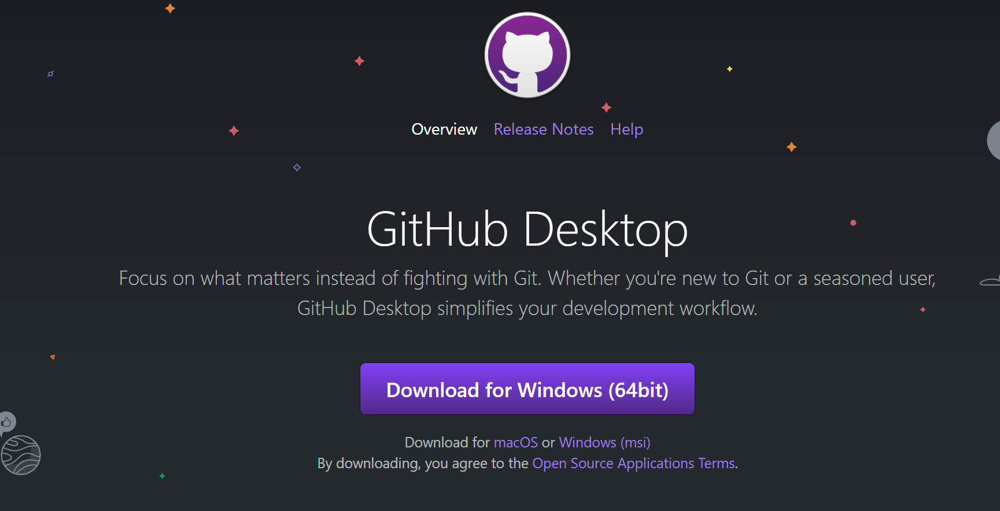

安装之前先安装git

[Git (git-scm.com)](https://git-scm.com/)

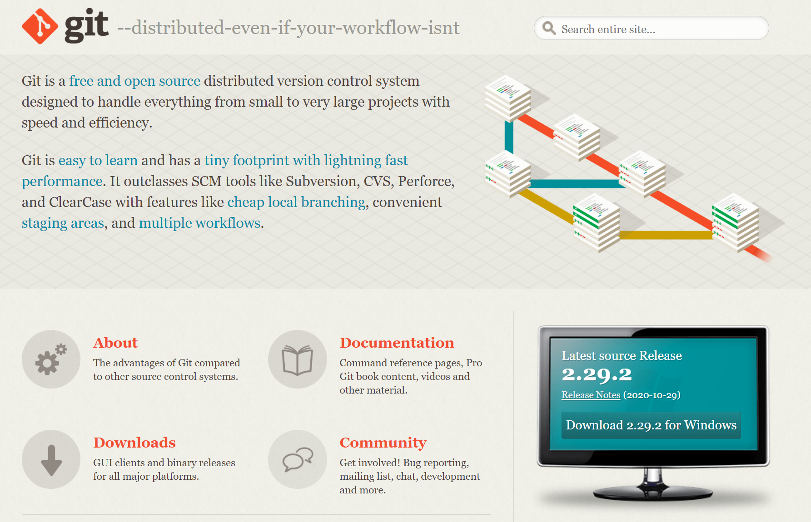

如果代码库中有100MB以上文件请先安装git lfs

[Git Large File Storage](https://git-lfs.github.com/)

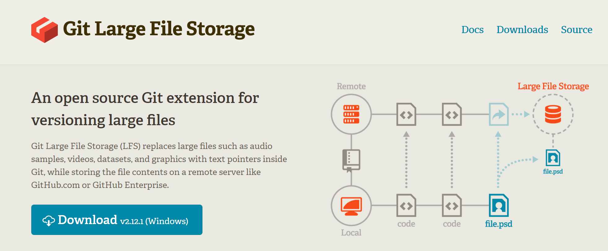

github学生礼包

github学生礼包中包含多种付费服务器、域名、云存储等开发资源

[GitHub Student Developer Pack - GitHub Education](https://education.github.com/pack)

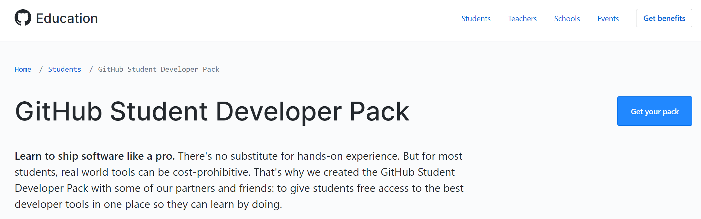

## clash

网络流量管理器

https://world.crisp.help/zh/article/clash-for-windows-xvf25w/

乘车码：

## Typora

简单好用的markdown编辑器

[Typora — a markdown editor, markdown reader.](https://typora.io/)

## listary

全局文件查找

[Listary – File Search & App Launcher](https://www.listary.com/)

## captura

强大简洁的屏幕录制软件

[Captura (mathewsachin.github.io)](https://mathewsachin.github.io/Captura/)

## snipaste

[Snipaste](https://www.snipaste.com/)

## 网盘软件

常备份，防止猝死

[百度网盘——百度网盘，让美好永远陪伴 (baidu.com)](https://pan.baidu.com/pcloud/home)

校园邮箱注册OneDrive可以免费领取1TB onedrive网盘空间

https://www.microsoft.com/en-us/microsoft-365/onedrive/graduation

## 视频播放

VLC player

[Official download of VLC media player, the best Open Source player - VideoLAN](https://www.videolan.org/vlc/index.html)

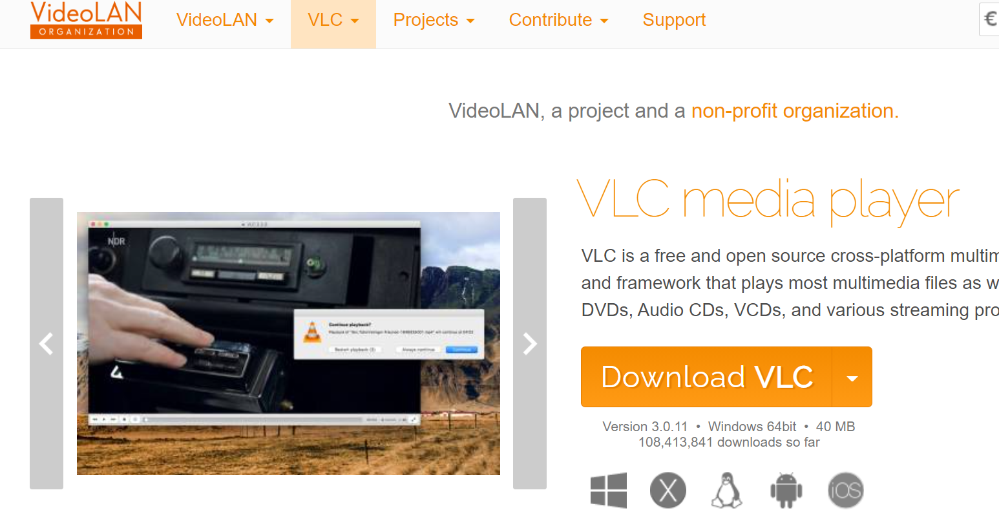

最全最稳定的播放器

POT player

[Global Potplayer (daum.net)](https://potplayer.daum.net/)

最强大的播放器

## notion

强大的基于web的笔记软件，不适合手写

[Notion – The all-in-one workspace for your notes, tasks, wikis, and databases.](https://www.notion.so/)

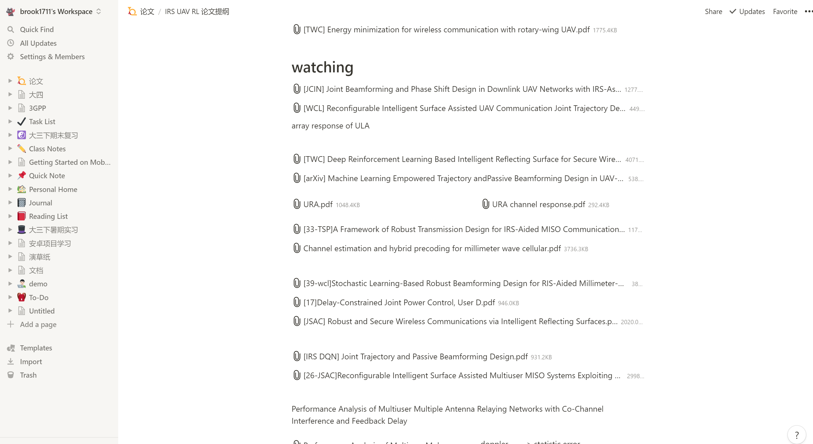

# 常用网站

## 科学网站

https://n3ro.lol/auth/register?code=LWBZ

若链接失效，github站内私信我

## 全功能网站

[Google](https://www.google.com.hk/)

[Wikipedia](https://www.wikipedia.org/)

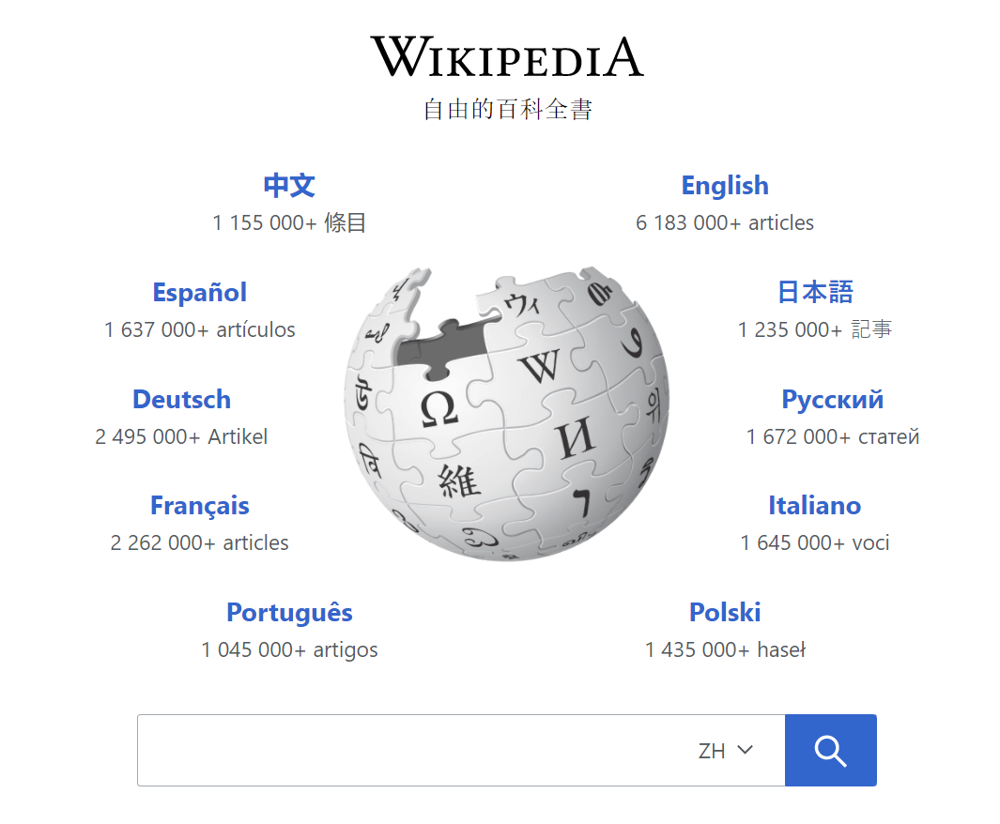

## 程序员锻炼

https://leetcode-cn.com/problemset/all/

## debug常用

[Stack Overflow - Where Developers Learn, Share, & Build Careers](https://stackoverflow.com/)

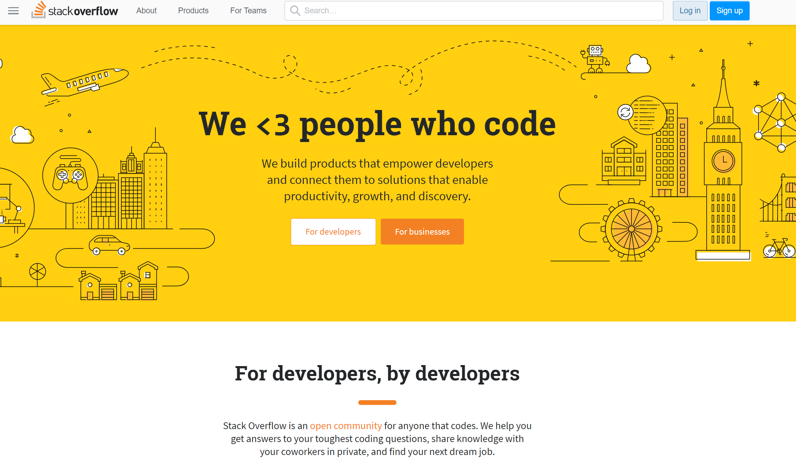

## 北邮微软全家桶

[msca.bupt.edu.cn/Home/IndexPage](http://msca.bupt.edu.cn/Home/IndexPage)

仅限校园网下载，提供全平台免费office、win10专业版等

请配套网站激活补丁食用

## 最强校内资源站

[BYRBT :: 种子 - Powered by NexusPHP](https://bt.byr.cn/torrents.php?cat=403&secocat=31)

50天内没有任何数据交互就会被删号

配合[BYRBT :: 查看主题 "µTorrent Stable BYR定制版(2.0/2.0.4/3.3.1)" - Powered by NexusPHP](https://bt.byr.cn/forums.php?action=viewtopic&forumid=15&topicid=266)

帖内软件食用

## 科研资源

[Google Scholar](https://scholar.google.com/)

建议与clash配合使用，也可以使用镜像站点

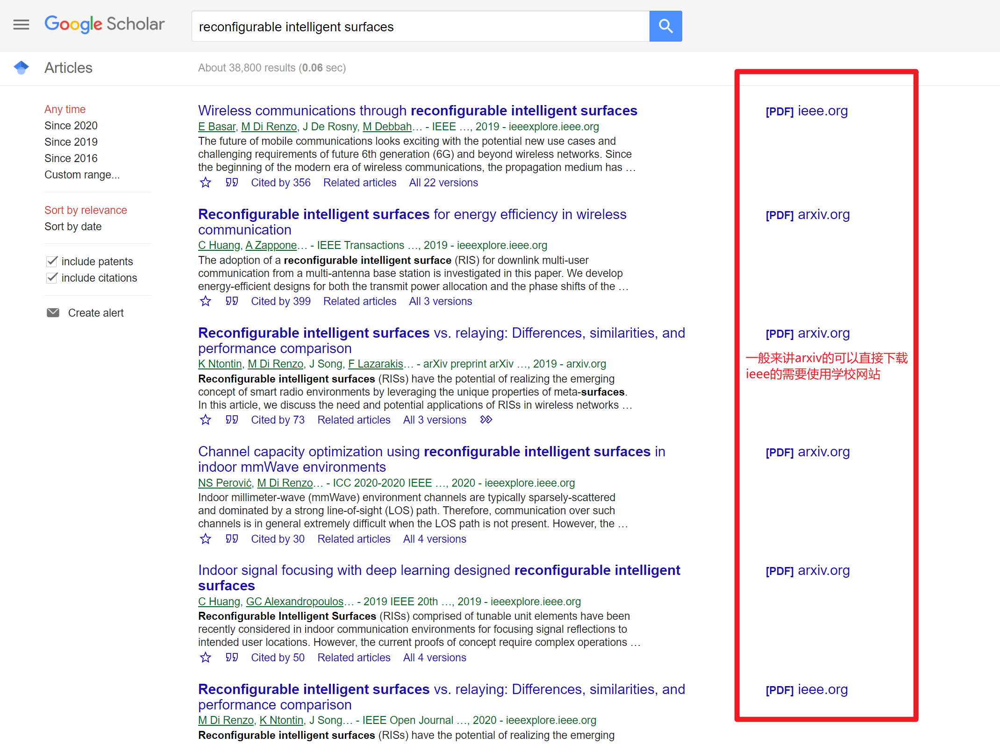

北邮图书馆——SCI、IEEE、知网等

[电子资源统一访问系统登录门户 (bupt.edu.cn)](https://libcon.bupt.edu.cn/)

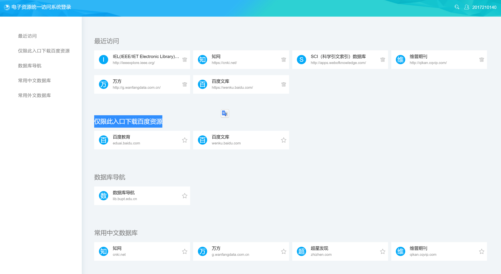

一般来讲，IEEE J、T 质量较高；C较短；L次之。IEEE也是有分区的

[2019年最新中科院 SCI 期刊分区（电气与电子工程） - 知乎 (zhihu.com)](https://zhuanlan.zhihu.com/p/113008581)

## 科研工具

### matlab

在北邮资源站上可以找到，一定要用校园邮箱注册

[msca.bupt.edu.cn/Home/IndexPage](http://msca.bupt.edu.cn/Home/IndexPage)

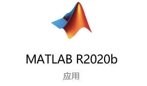

# 生命苦短我用python

## anaconda

[Anaconda | Individual Edition](https://www.anaconda.com/products/individual)

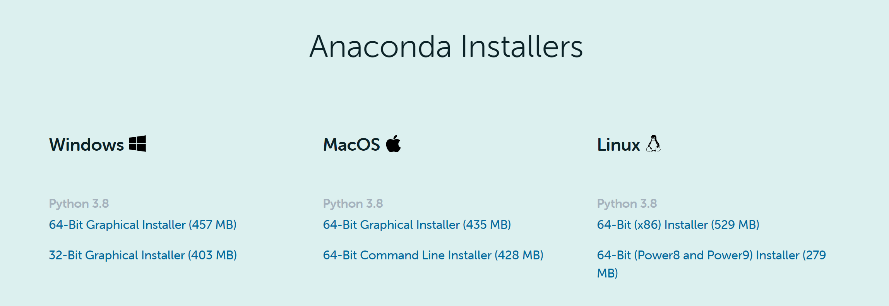

基本上是对新手最友好的第三方库管理软件

下载安装一定要选中“add to path”

## VS CODE

[Visual Studio Code - Code Editing. Redefined](https://code.visualstudio.com/)

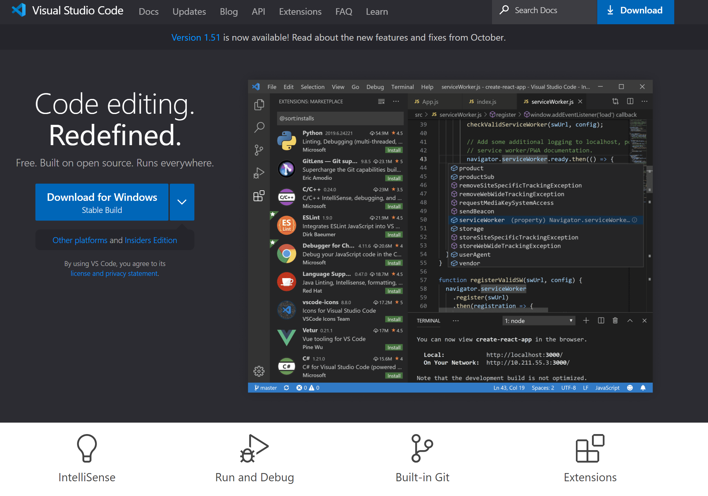

轻量级但强大的IDE，不仅仅可以搭建python开发环境，还可以配合第三方插件搭建所有语言的开发环境

## 第三方whl文件

https://www.lfd.uci.edu/~gohlke/pythonlibs/#gdal

如果安装python库出现bug，python版本确认无误后到该网站下载.whl进行安装。

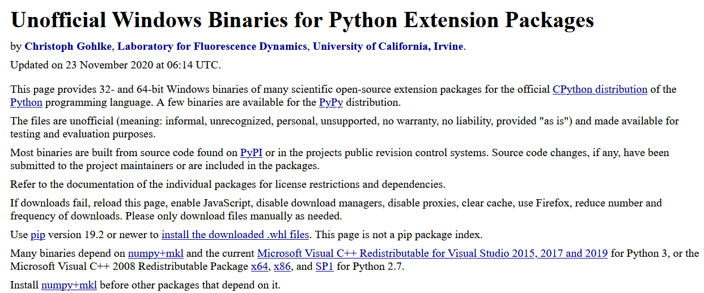

## 代码托管平台

相当于一个网盘，只不过这个网盘专门为代码项目工程设计，可以清晰的展示出你的代码修改历史，而且可以对你的每个版本的代码进行对比

### github

[GitHub官网](https://github.com/)

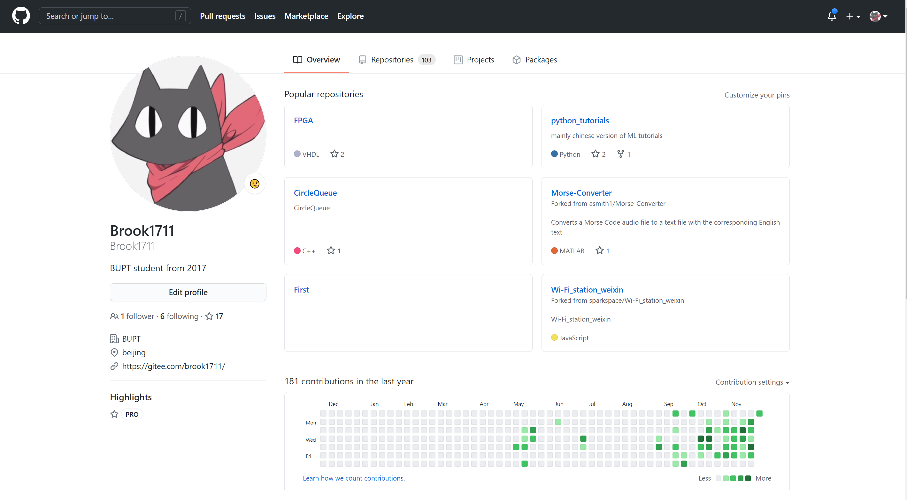

[我的主页](https://github.com/Brook1711)

### GitHub desktop具体使用方法

**一定要记得先安装git**

1、创建空白仓库：

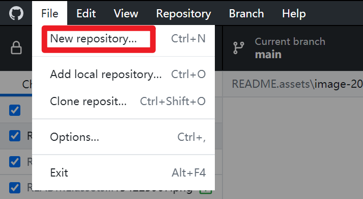

2、设置仓库属性并创建

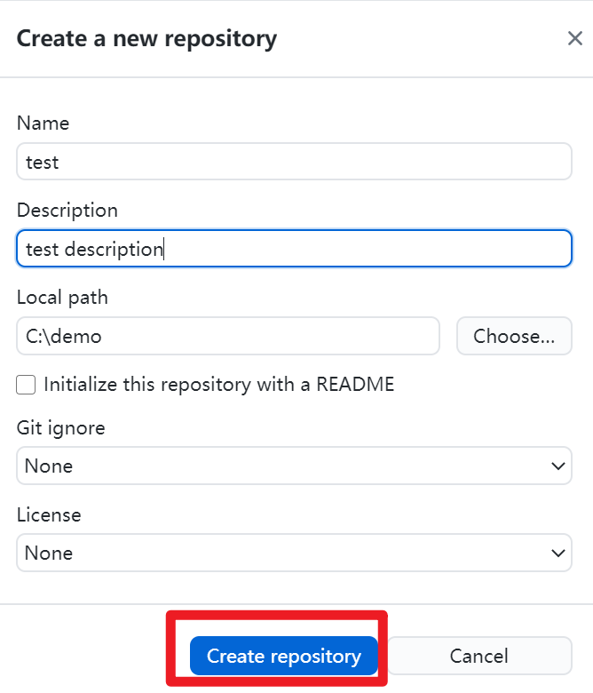

3、视图解释

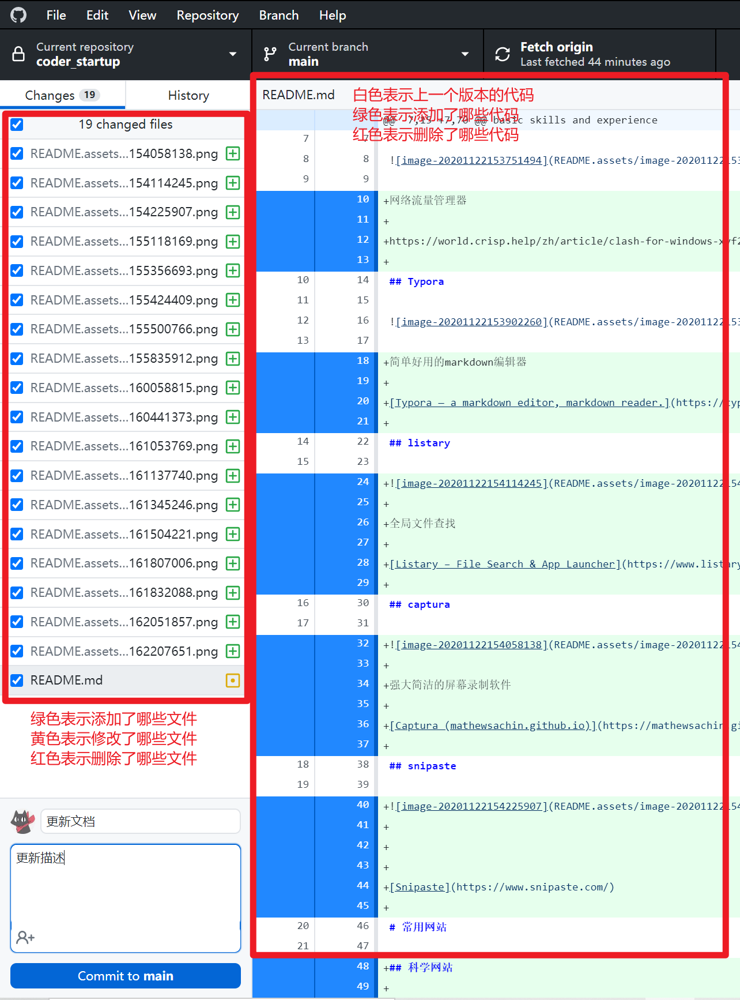

4、点击左下角“commit to **main**”

即可将更改保存到本地'.git'文件中

但是此时修改并没有保存到云端

这是点击“Push origin”即可保存到云端

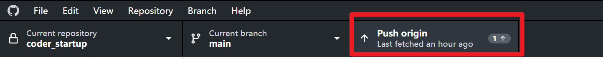

## Gitee

[Gitee - 基于 Git 的代码托管和研发协作平台](https://gitee.com/)

本土化github，使用方法和github一样，但是速度更快，而且可以镜像github，如果你有什么项目在clone github上的项目的时候速度太慢，试着先导入到你的gitee中，再从gitee中clone

# 最后

祝福看到这里的你，希望对你有所帮助，如果你有什么经验想要补充，有以下几种方式

1、请在github中的issue中提出来（推荐）

2、github中私信（推荐）

3、fork这个仓库并提交分支

